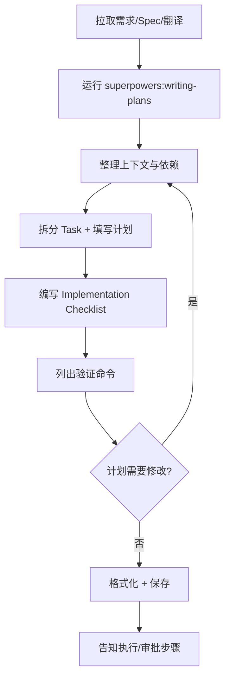

# 写计划流程速览

本文提供在本仓库撰写实施计划（plan）的标准流程，适用于所有需要产出 `docs/plans/*.md` 的任务。请在执行前阅读 @/openspec/AGENTS.md 与 superpowers:writing-plans skill。

## 前置准备

1. **同步需求**：获取最新的业务需求文档（如 `#57791需求.md`）、翻译表、Figma 节点列表。若含引用链接，逐个访问确认。
2. **阅读规范**：
   - `openspec/project.md`、对应 `openspec/changes/<id>/` 下的 proposal/tasks/spec。
   - `docs/design/*` 中的样式基线与 tokens。
   - `AGENTS.md` 中的模式/Hook 要求。
3. **加载技能**：在写计划前运行：
   ```bash
   ~/.codex/superpowers/.codex/superpowers-codex use-skill superpowers:writing-plans
   ```
4. **准备工具**：确保 figma MCP、Playwright MCP、pnpm、Prettier 可用；必要时先同步环境。

## 操作步骤

1. **梳理上下文**：整理需求要点、Figma 节点、翻译链接、依赖的 spec/组件路径。在计划中列出引用来源。
2. **规划任务结构**：按照“数据→组件→样式→i18n→测试”的顺序拆分 Task，明确影响文件、命令和期望输出。
3. **撰写计划**：
   - 使用 `docs/plans/YYYY-MM-DD-<topic>.md`，引用 superpowers skill 中的 header 模板。
   - 每个 Task 包含：涉及文件、命令、预期验证方式。
   - 追加 Implementation Checklist（原子化步骤）。
4. **补充验证与链接**：列出 lint/test/build/Playwright/Figma diff/UTF-8 等命令，并附相关文档链接（PRPS、设计说明、模板等）。
5. **格式化与保存**：运行 `pnpm prettier -w docs/plans/<file>.md`，必要时执行 `pnpm run lint:md`。
6. **告知执行策略**：在计划末尾写清下一步（例如“使用 superpowers:executing-plans 执行 Task”或“提交审批”）。

## 常见注意事项

- **模式切换**：严格按照 AGENTS.md 的 RESEARCH→PLAN→EXECUTE→REVIEW 流程，缺失 Hook 要向用户报备。
- **引用完整**：所有 Figma 节点、翻译表、spec、现有组件路径需在计划中点名，方便执行者查找。
- **命令真实可跑**：列出的 pnpm/figma/Playwright 命令在当前仓库必须可执行；若需要外部工具，注明前置条件。
- **验证闭环**：Checklist 必须覆盖“lint/test/build/Playwright diff/UTF-8”等必要验证，不可只写“检查一下”。
- **敏感信息**：遇到“giga”等敏感词要在计划中强调替换为 “Custom”，避免后续实现遗漏。

## 流程图



## 相关链接

- [superpowers:writing-plans skill](../templates/README#superpowers)
- [Plan 示例：Index Dialog](../plans/2025-11-11-index-dialog.md)
- [PRPS 模板](../../PRPS/basic.md)
- [openspec/project.md](../../openspec/project.md)
- [Figma 节点使用指南](../design/buyer-center-style-map.md)

> 建议在计划完成后，立刻运行 `pnpm prettier -w docs/plans/<filename>.md`，并通过 `git status -sb` 确认只有预期文件发生变化。
